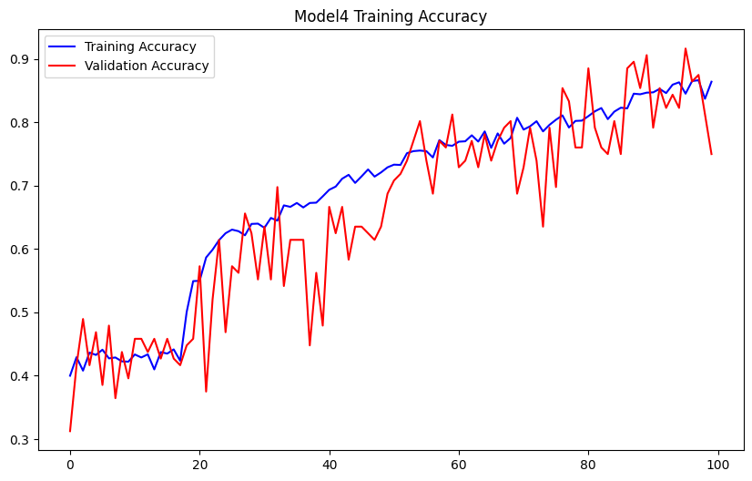
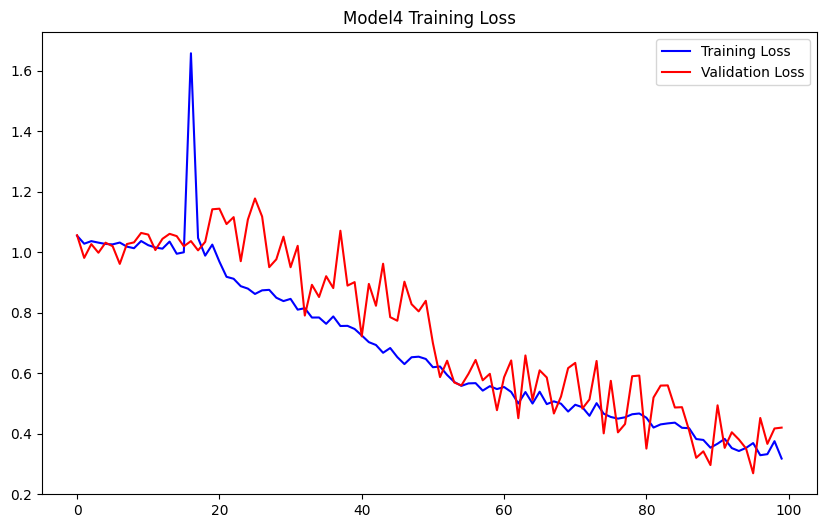

<h1>A Model for Optimizing Detection and Classification of Lung Cancer Using CNN (Convolutional Neural Network).</h1>

Lung cancer is a serious disease occurring in human being. Medical treatment process mainly depends on cancer types and its location. It is possible to save many precious human lives by detecting cancer cells as early as possible. Developing an automated tool is essential to detecting malignant states at the earliest possible stage. The accuracy of prediction has always been a challenge, despite the many algorithms proposed in the past by many researchers. Using artificial neural networks, this study proposes a methodology to detect abnormal lung tissue growth. In order to achieve great accuracy, a tool with a higher probability of detection is taken into account. The manual interpretation of results is incapable of avoiding misdiagnoses. During the course of this research, lung images from both healthy and malignant individuals were collected as samples for our dataset. A neural network, based on the textural characteristics of the images, makes it feasible for classification of the normal images, identifying away from the malignant ones. In order to overcome this problem, CNN and Google Net deep learning algorithms have been proposed to detect Cancer. Both the region proposal network and the classifier network use the VGG-16 architecture as their base layer. The algorithm achieves a precision of 100% in detection and classification in the 4th model of the model developed. Based on confusion matrix computation and classification accuracy results, a quantitative analysis of the proposed network has been conducted.

<h2>Dataset</h2>
The Iraq-Oncology Teaching Hospital/National Center for Cancer Diseases (IQ-OTH/NCCD) lung cancer dataset was collected in the above-mentioned specialist hospitals over a period of three months in fall 2019. It includes CT scans of patients diagnosed with lung cancer in different stages, as well as healthy subjects. IQ-OTH/NCCD slides were marked by oncologists and radiologists in these two centers. The dataset contains a total of 1190 images representing CT scan slices of 110 cases (see Figure 1). These cases are grouped into three classes: normal, benign, and malignant. of these, 40 cases are diagnosed as malignant; 15 cases diagnosed with benign, and 55 cases classified as normal cases. The CT scans were originally collected in DICOM format. The scanner used is SOMATOM from Siemens. CT protocol includes: 120 kV, slice thickness of 1 mm, with window width ranging from 350 to 1200 HU a and window center from 50 to 600 were used for reading. with breath-hold at full inspiration. All images were de-identified before performing analysis. Written consent was waived by the oversight review board. The study was approved by the institutional review board of participating medical centers. Each scan contains several slices. The number of these slices range from 80 to 200 slices, each of them represents an image of the human chest with different sides and angles. The 110 cases vary in gender, age, educational attainment, area of residence, and living status. Some of them are employees of the Iraqi ministries of Transport and Oil, others are farmers and gainers. Most of them come from places in the middle region of Iraq, particularly, the provinces of Baghdad, Wasit, Diyala, Salahuddin, and Babylon.
<i>Graphical images count of datasets</i>

<h2>Image Size Variations</h2>
The datasets used in this research project differs significantly in variation sizes and this can be due to various reasons. The variation sizes include;

{'Bengin_cases': {'64 x 64': 396, '512 x 512': 84},
 'Malignant_cases': {'64 x 64': 860,
  '512 x 512': 332,
  '404 x 511': 1,
  '512 x 801': 28,
  '512 x 623': 31},
 'Normal_cases': {'64 x 64': 860, '512 x 512': 291}}

<h2>Data preprocessing module</h2>
Data preprocessing is help full to converts the available raw image
data into common attributes to proper processing of images. The
data may be collected from different platform and may have different
presentation with different attributes. This data cannot be directly
passed to neural network, so there is need to be converting all data
attributes similar. Training CNN or VGG19 on raw image dataset may
decrease the performance of classification [59]. This work preprocesses
raw input images using following seven preprocessing methods before
passed to the VGG19 network.
• Data Mounting
• Data Resizing
• Data Encoding
• Data Shuffling
• Data Visualization
• Data Generation
• Data Reshaping

<h2>Data augmentation</h2>
The performance of neural network is totally depending on the training data size and accessibility of data. The neural network can train effectively with different variety of data. The Augmentation technique used to generate various form of same limited amount of image data. This technique also helps to overcome network model over fitting problem. This work use stain normalization and transformation with basic image augmentation methods. Stain normalization is basic methods used in CAS system for image processing. Stain normalization is very effective to minimize color variation and color intensity form input images, so it improves the prediction performance of classifiers. Algorithm Data augmentation of Lung CT scans images

<h2>VGG19 model and training</h2>
The VGG19 is a modified version of CNN network it is a pre-trained network. The training of VGG19 network has been done with ImageNet dataset, it achieved remarkable performance on other image dataset for object identification and image classification. In this project, we've added the VGG network for you to test on your dataset, call the VGG network function in this project to train it on your dataset. 

<h2>Discussion</h2>
<h3>Model Training and Implementation</h3>
For this project model training, we've implemented a four level configuration model type with the VGG network summing it to 5. Train and test for each of this model with any modified input shape sizes that fits your needs.
• Model 1 configuration with (adam optim) - input_shape=(512,512,3)
• Model 2 configuration with (RMSprop optim) - input_shape=(256,256,3)
• Model 3 configuration with (Adams optim) - input_shape=(128,128,3)
• Model 4 configuration with (Adams optim) - input_shape=(64,64,3)

<h4>Training the models</h4>
## Note:
* I used a small size of epochs (50-100) because I used a CPU and this actually took up to >8 hours
* For improved predictive accuracy, the number of epochs should be set to around (200 to 250) so the model can learn more
* Use a GPU System</b>  

<b>ReduceLROnPlateau():</b>  
In order to make the optimizer converge faster and closest to the global minimum of the loss function, i used an annealing method of the learning rate (LR).

The LR is the step by which the optimizer walks through the 'loss landscape'. The higher LR, the bigger are the steps and the quicker is the convergence. However the sampling is very poor with an high LR and the optimizer could probably fall into a local minima.

Its better to have a decreasing learning rate during the training to reach efficiently the global minimum of the loss function.

To keep the advantage of the fast computation time with a high LR, i decreased the LR dynamically every X steps (epochs) depending if it is necessary (when accuracy is not improved).

With the ReduceLROnPlateau function from Keras.callbacks, i choose to reduce the LR by half if the accuracy is not improved after 3 epochs.    

<b>EarlyStopping():</b>  
In order to reduce (optimize) computational resources, i used an early-stopping mechanism to stop the learning if the validation-loss is not reduced after 5 rounds, at which point it can be assumed the model is no more learning. This can also help prevent over-fitting.

Summary of the 4th model training

Epoch 1/100
67/67 [==============================] - 201s 3s/step - loss: 1.0544 - accuracy: 0.4000 - val_loss: 1.0558 - val_accuracy: 0.3125
Epoch 2/100
67/67 [==============================] - 172s 3s/step - loss: 1.0279 - accuracy: 0.4293 - val_loss: 0.9810 - val_accuracy: 0.4167
Epoch 3/100
67/67 [==============================] - 208s 3s/step - loss: 1.0364 - accuracy: 0.4080 - val_loss: 1.0265 - val_accuracy: 0.4896
Epoch 4/100
67/67 [==============================] - 189s 3s/step - loss: 1.0314 - accuracy: 0.4366 - val_loss: 0.9980 - val_accuracy: 0.4167
Epoch 5/100
67/67 [==============================] - 184s 3s/step - loss: 1.0271 - accuracy: 0.4328 - val_loss: 1.0313 - val_accuracy: 0.4688
<i>skip..</i>
Epoch 21/100
67/67 [==============================] - 175s 3s/step - loss: 0.9686 - accuracy: 0.5499 - val_loss: 1.1437 - val_accuracy: 0.5729
Epoch 22/100
67/67 [==============================] - 174s 3s/step - loss: 0.9185 - accuracy: 0.5868 - val_loss: 1.0928 - val_accuracy: 0.3750
Epoch 23/100
67/67 [==============================] - 190s 3s/step - loss: 0.9120 - accuracy: 0.5991 - val_loss: 1.1158 - val_accuracy: 0.5208
Epoch 24/100
67/67 [==============================] - 426s 6s/step - loss: 0.8875 - accuracy: 0.6142 - val_loss: 0.9701 - val_accuracy: 0.6146
<i>skip..</i>
Epoch 41/100
67/67 [==============================] - 203s 3s/step - loss: 0.7247 - accuracy: 0.6936 - val_loss: 0.7217 - val_accuracy: 0.6667
Epoch 42/100
67/67 [==============================] - 208s 3s/step - loss: 0.7025 - accuracy: 0.6987 - val_loss: 0.8951 - val_accuracy: 0.6250
Epoch 43/100
67/67 [==============================] - 204s 3s/step - loss: 0.6931 - accuracy: 0.7111 - val_loss: 0.8228 - val_accuracy: 0.6667
Epoch 44/100
67/67 [==============================] - 218s 3s/step - loss: 0.6674 - accuracy: 0.7173 - val_loss: 0.9617 - val_accuracy: 0.5833
<i>skip..</i>
Epoch 61/100
67/67 [==============================] - 181s 3s/step - loss: 0.5543 - accuracy: 0.7696 - val_loss: 0.5863 - val_accuracy: 0.7292
Epoch 62/100
67/67 [==============================] - 174s 3s/step - loss: 0.5378 - accuracy: 0.7702 - val_loss: 0.6420 - val_accuracy: 0.7396
Epoch 63/100
67/67 [==============================] - 185s 3s/step - loss: 0.4998 - accuracy: 0.7797 - val_loss: 0.4511 - val_accuracy: 0.7708
Epoch 64/100
67/67 [==============================] - 176s 3s/step - loss: 0.5376 - accuracy: 0.7697 - val_loss: 0.6585 - val_accuracy: 0.7292
<i>skip..</i>
Epoch 81/100
67/67 [==============================] - 190s 3s/step - loss: 0.4526 - accuracy: 0.8099 - val_loss: 0.3506 - val_accuracy: 0.8854
Epoch 82/100
67/67 [==============================] - 184s 3s/step - loss: 0.4202 - accuracy: 0.8175 - val_loss: 0.5195 - val_accuracy: 0.7917
Epoch 83/100
67/67 [==============================] - 205s 3s/step - loss: 0.4306 - accuracy: 0.8227 - val_loss: 0.5589 - val_accuracy: 0.7604
Epoch 84/100
67/67 [==============================] - 204s 3s/step - loss: 0.4339 - accuracy: 0.8052 - val_loss: 0.5596 - val_accuracy: 0.7500
<i>skip..</i>

loss	accuracy	val_loss	val_accuracy
0	1.054366	0.400000	1.055756	0.312500
1	1.027903	0.429314	0.981037	0.416667
2	1.036392	0.408038	1.026498	0.489583
3	1.031448	0.436567	0.998046	0.416667
4	1.027121	0.432836	1.031299	0.468750
...	...	...	...	...
95	0.368863	0.845390	0.269020	0.916667
96	0.328764	0.865248	0.451903	0.864583
97	0.332171	0.866667	0.366198	0.875000
98	0.375166	0.837352	0.417116	0.812500
99	0.317687	0.864303	0.419942	0.750000

<h4>Visualizing Training Result<h4>
<b>Training Accuracy</b>

<b>Training Loss</b>

<b>Accuracy vs Loss for Model</b>

<h4>Evaluating the Trained Models Prediction with the Test Set</h4>
Class Indices: 
{'Bengin_cases': 0, 'Malignant_cases': 1, 'Normal_cases': 2}

True Labels: 
[0 0 0 0 0 0 0 0 0 0 0 0 0 0 0 0 0 0 0 0 0 0 0 0 0 0 0 0 0 0 0 0 0 0 0 0 0
 0 0 0 0 0 0 0 0 0 0 0 0 0 0 0 0 0 0 1 1 1 1 1 1 1 1 1 1 1 1 1 1 1 1 1 1 1
 1 1 1 1 1 1 1 1 1 1 1 1 1 1 1 1 1 1 1 1 1 1 1 1 1 1 1 1 1 1 1 1 1 1 1 1 1
 1 1 1 1 1 1 1 1 1 1 1 1 1 1 1 1 1 1 1 1 1 1 1 1 1 1 1 1 1 1 1 1 1 1 1 1 1
 1 1 1 1 1 1 1 1 1 1 1 1 1 1 1 1 1 1 1 1 1 1 1 1 1 1 1 1 1 1 1 1 1 1 1 1 1
 1 1 1 1 1 1 1 1 1 1 1 1 1 1 1 1 1 1 1 1 1 1 1 1 1 1 1 1 1 1 1 1 1 1 1 1 1
 1 1 1 1 1 1 1 1 1 1 1 2 2 2 2 2 2 2 2 2 2 2 2 2 2 2 2 2 2 2 2 2 2 2 2 2 2
 2 2 2 2 2 2 2 2 2 2 2 2 2 2 2 2 2 2 2 2 2 2 2 2 2 2 2 2 2 2 2 2 2 2 2 2 2
 2 2 2 2 2 2 2 2 2 2 2 2 2 2 2 2 2 2 2 2 2 2 2 2 2 2 2 2 2 2 2 2 2 2 2 2 2
 2 2 2 2 2 2 2 2 2 2 2 2 2 2 2 2 2 2 2 2 2 2 2 2 2 2 2 2 2 2 2 2 2 2 2 2 2
 2 2 2 2 2 2 2 2 2 2 2 2 2 2 2 2 2 2 2 2 2 2 2 2 2 2]

<h4>Predictions from the test set</h4>
 
pred_labels	true_labels	pred_values	true_values
196	1	1	Malignant_cases	Malignant_cases
197	1	1	Malignant_cases	Malignant_cases
198	1	1	Malignant_cases	Malignant_cases
199	1	1	Malignant_cases	Malignant_cases
200	1	1	Malignant_cases	Malignant_cases
...	...	...	...	...
391	2	2	Normal_cases	Normal_cases
392	2	2	Normal_cases	Normal_cases
393	2	2	Normal_cases	Normal_cases
394	2	2	Normal_cases	Normal_cases
395	2	2	Normal_cases	Normal_cases

<h4>Performance Evaluation</h4>
		Classification Report for the 4th Model (@64x64)
		----------------------------------

              precision    recall  f1-score   support

           0       0.75      0.73      0.74        55
           1       0.98      0.98      0.98       178
           2       0.89      0.90      0.90       163

    accuracy                           0.91       396
   macro avg       0.88      0.87      0.87       396
weighted avg       0.91      0.91      0.91       396

<h4>Confusion Matrix<h4>

<h4>Evaluation metrics</h4>
Evaluation Metrics for the 4th Model (@64x64)
----------------------------

Accuracy: 	 0.914
Recall: 	 0.914
Precision: 	 0.913
F1-Score: 	 0.914

<h4>Conclusion</h4>
Machine learning becomes a vibrating field in last decade and deep learning techniques give as new height to it. Now with help of modern hardware and software, a lot of experiments are performing well with new model to solve real world problems using deep leaning. This work is focused on lung cancer diagnosis using deep learning model by improving pre-trained VGG19 model and using CNN techniques for early and effective cancer prediction.